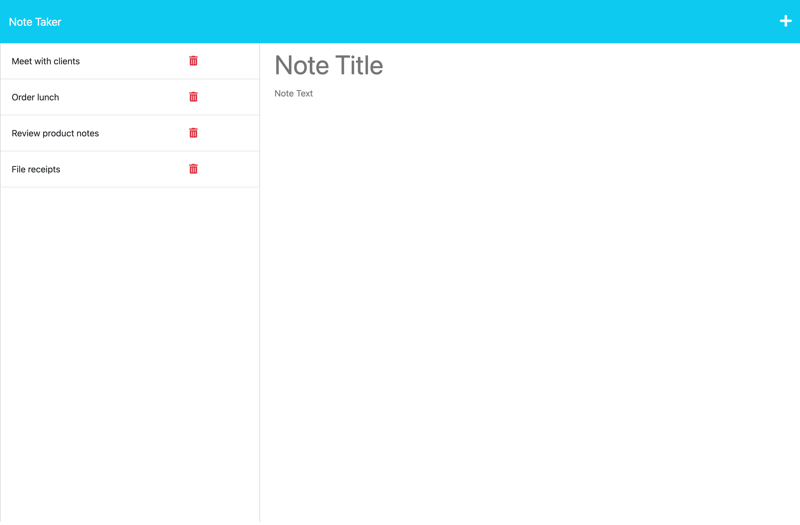
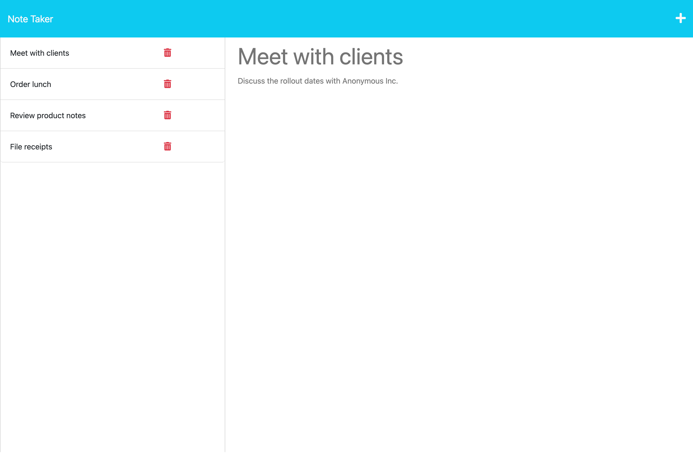

# Note Taker

## Description
This web application was created to allow a user to write and save notes using a simple UI.

## Usage
When the website is loaded it will take the user to a landing page with a link to open your notes and be able to write new notes. Each note will contain a title and a body. When the user saves a new note, the title will appear in a left hand column. When the user clicks on the title, the note will appear in the main section of the app. When the user wants to add a new note, they can click on the plus sign in the top right hand corner of the screen.

You can visit the website [here](https://note-taker97jf.herokuapp.com/) and view a screenshot of the webpage here:

## Credits
The UI was designed by Xander Rapstine, John McCambridge, and George Yoo.

## License
Please refer to the LICENSE in the repo.